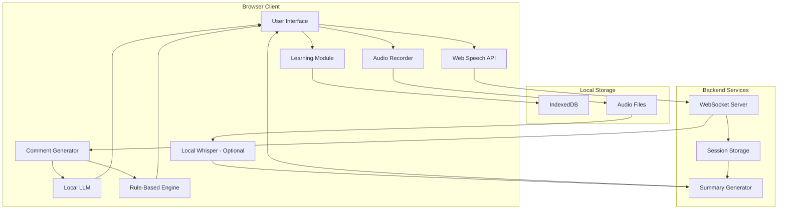

# Design Document: MONOLOG LIVE

## Overview

MONOLOG LIVE is a web-based conversational service that simulates a live streaming comment section experience. Users engage in natural voice conversations while an AI system generates diverse, contextually appropriate comments using multiple personality roles. The architecture combines rule-based and local LLM processing during sessions to maintain both conversation quality and cost efficiency, with enhanced processing available for session-end summaries.

The system follows a hybrid processing approach: combining lightweight rule-based comment generation with local LLM processing during active sessions to maintain conversation quality, while avoiding expensive cloud API calls. Optional enhanced features like local Whisper transcription provide additional quality improvements without compromising the core functionality.

## Architecture

### High-Level Architecture



### Component Architecture

The system uses a modular architecture with clear separation between real-time processing and optional enhanced processing components:

**Real-time Layer (Session Active):**
- Web Speech API for continuous voice input
- Audio recording for local storage
- Hybrid comment generation: rule-based + local LLM processing
- WebSocket communication for low-latency responses
- Client-side learning and preference tracking

**Enhanced Processing Layer (Optional):**
- Local Whisper transcription for improved accuracy
- Advanced session analysis and summarization
- High-quality audio processing and storage management

## Components and Interfaces

### Audio Recording Component

**Local Audio Storage:**
```typescript
interface AudioRecorder {
  startRecording(): void;
  stopRecording(): Promise<AudioFile>;
  getRecordingStatus(): RecordingStatus;
  configureQuality(settings: AudioQualitySettings): void;
}

interface AudioManager {
  saveAudioFile(audio: AudioFile, sessionId: string): Promise<string>;
  getAudioFiles(userId: string): Promise<AudioFile[]>;
  deleteAudioFile(fileId: string): Promise<boolean>;
  getStorageUsage(): Promise<StorageInfo>;
}
```

The audio recording component captures user speech for local storage and optional enhanced processing:

**Key Features:**
- Continuous audio recording during sessions
- Configurable quality settings (bitrate, format)
- Local file storage with session association
- Storage management and cleanup utilities

### Voice Input Component

**Web Speech API Integration:**
```typescript
interface VoiceInputManager {
  startListening(): void;
  stopListening(): void;
  onTranscript(callback: (text: string, isFinal: boolean) => void): void;
  onError(callback: (error: SpeechRecognitionError) => void): void;
}
```

The voice input component provides continuous speech recognition with real-time transcription display. It handles browser compatibility issues and provides fallback mechanisms for unsupported browsers.

**Key Features:**
- Continuous recognition with interim results
- Automatic restart on silence detection
- Error handling and recovery
- Language detection and adaptation

### Comment Generation Engine

**Hybrid Comment System:**
```typescript
interface CommentRole {
  type: CommentRoleType;
  weight: number;
  patterns: string[];
  triggers: TriggerCondition[];
}

interface CommentGenerator {
  generateComment(context: ConversationContext): Comment;
  updateRoleWeights(feedback: UserFeedback): void;
  getActiveRoles(): CommentRole[];
}

interface LocalLLMProcessor {
  generateContextualComment(context: ConversationContext, role: CommentRole): Promise<string>;
  isAvailable(): boolean;
  getModelInfo(): ModelInfo;
}
```

The comment generation engine implements a hybrid approach combining rule-based and local LLM processing:

**Comment Generation Strategy:**
- **Rule-based comments (60-70%):** Fast, reliable, pattern-based responses
- **Local LLM comments (30-40%):** Contextual, creative, personalized responses
- **Dynamic mixing:** Adjust ratio based on system performance and user preferences

The eight distinct comment roles remain as specified:

1. **Greeting/Entry Role:** Welcome messages and introductions
2. **Departure Role:** Goodbye and leaving messages  
3. **Reaction Role:** Emotional responses and reactions
4. **Agreement Role:** Supportive and confirmatory comments
5. **Question Role:** Conversation starters and inquiries
6. **Insider Role:** Regular viewer and callback references
7. **Support Role:** Encouraging and caring messages
8. **Playful Role:** Teasing and humorous interactions

**Local LLM Integration:**
- WebLLM or similar browser-based LLM for contextual comment generation
- Lightweight models optimized for short text generation
- Fallback to rule-based generation if local LLM unavailable
- Performance monitoring to balance quality and responsiveness

### Learning and Personalization Module

**Preference Tracking System:**
```typescript
interface UserPreferences {
  roleWeights: Map<CommentRoleType, number>;
  topicPreferences: string[];
  interactionHistory: InteractionEvent[];
  sessionCount: number;
}

interface LearningModule {
  trackInteraction(comment: Comment, userResponse: UserResponse): void;
  updatePreferences(userId: string, feedback: Feedback): void;
  getPersonalizedWeights(userId: string): Map<CommentRoleType, number>;
}
```

The learning module implements lightweight preference tracking without requiring LLM retraining:

**Learning Mechanisms:**
- Comment pickup detection through timing analysis
- Explicit user feedback via thumbs up/down
- Topic preference extraction from conversation patterns
- Role effectiveness scoring based on user engagement

### Session Management Component

**Session Lifecycle:**
```typescript
interface SessionManager {
  startSession(userId: string, topic?: string): Session;
  endSession(sessionId: string): Promise<SessionSummary>;
  trackActivity(sessionId: string, activity: ActivityEvent): void;
  generateSummary(session: Session): Promise<SessionSummary>;
}
```

**Session Data Structure:**
- Real-time transcript with timestamps
- Comment interaction logs
- User engagement metrics
- Topic progression tracking

### Enhanced Transcription Component (Optional)

**Local Whisper Integration:**
```typescript
interface EnhancedTranscription {
  isAvailable(): boolean;
  transcribeAudio(audioFile: AudioFile): Promise<TranscriptionResult>;
  getModelInfo(): WhisperModelInfo;
  configureModel(settings: WhisperSettings): void;
}

interface TranscriptionResult {
  text: string;
  confidence: number;
  segments: TranscriptionSegment[];
  language: string;
}
```

The enhanced transcription component provides optional high-quality transcription using local Whisper models:

**Key Features:**
- Browser-based Whisper implementation (whisper.cpp via WebAssembly)
- Offline processing without cloud dependencies
- Multiple language support
- Configurable model size (tiny, base, small) based on device capabilities
- Integration with session summary generation

**Implementation Options:**
- whisper.cpp compiled to WebAssembly
- Xenova's Transformers.js with Whisper models
- WebLLM integration for unified local AI processing

### Summary Generation Component

**Enhanced Processing Pipeline:**
```typescript
interface SummaryGenerator {
  enhanceTranscript(rawTranscript: string, audioFile?: AudioFile): Promise<string>;
  extractTopics(transcript: string): Promise<Topic[]>;
  generateInsights(topics: Topic[]): Promise<Insight[]>;
  createSummary(session: Session): Promise<SessionSummary>;
}
```

The summary generator provides session-end analysis with optional enhanced transcription:

**Processing Steps:**
1. **Transcript Enhancement:** Use local Whisper (if available) or improve Web Speech API output
2. **Topic Extraction:** Identify main conversation themes using local processing
3. **Insight Generation:** Create meaningful observations about user thoughts
4. **Summary Creation:** Organize findings into digestible format

**Enhanced Features (Optional):**
- Local Whisper transcription for higher accuracy
- Advanced topic modeling using local LLM
- Sentiment analysis and emotional insights
- Conversation pattern recognition

## Data Models

### Core Data Structures

**Comment Model:**
```typescript
interface Comment {
  id: string;
  role: CommentRoleType;
  content: string;
  timestamp: Date;
  context: ConversationContext;
  userInteraction?: UserInteraction;
}
```

**Session Model:**
```typescript
interface Session {
  id: string;
  userId: string;
  startTime: Date;
  endTime?: Date;
  topic?: string;
  transcript: TranscriptSegment[];
  comments: Comment[];
  interactions: UserInteraction[];
  metrics: SessionMetrics;
}
```

**User Interaction Model:**
```typescript
interface UserInteraction {
  commentId: string;
  type: 'pickup' | 'click' | 'thumbs_up' | 'thumbs_down';
  timestamp: Date;
  confidence: number; // For automatic pickup detection
}
```

**Audio File Model:**
```typescript
interface AudioFile {
  id: string;
  sessionId: string;
  filename: string;
  format: AudioFormat;
  duration: number;
  size: number;
  createdAt: Date;
  quality: AudioQualitySettings;
}
```

**Enhanced Transcription Model:**
```typescript
interface TranscriptionSegment {
  start: number;
  end: number;
  text: string;
  confidence: number;
}

interface WhisperModelInfo {
  name: string;
  size: string;
  languages: string[];
  isLoaded: boolean;
}
```

### Storage Strategy

**Client-Side Storage (IndexedDB):**
- User preferences and learning data
- Session cache for offline capability
- Comment interaction history
- Audio files with session association
- Local model cache (Whisper, LLM weights)

**Server-Side Storage:**
- Complete session transcripts
- Generated summaries
- Aggregated analytics data
- User account information (if applicable)

## Correctness Properties

*A property is a characteristic or behavior that should hold true across all valid executions of a system—essentially, a formal statement about what the system should do. Properties serve as the bridge between human-readable specifications and machine-verifiable correctness guarantees.*

### Prework Analysis

Let me analyze the acceptance criteria for testability using the prework tool.

### Property Reflection

After analyzing all acceptance criteria, I've identified several areas where properties can be consolidated to eliminate redundancy:

**Learning Behavior Consolidation:**
- Properties 6.5, 6.6, 7.2, and 7.3 all test similar learning mechanisms (frequency adjustment based on feedback)
- These can be combined into comprehensive learning properties

**Comment Generation Consolidation:**
- Properties 2.1, 2.2, and 3.1-3.8 all relate to comment role implementation
- These can be consolidated into properties about role diversity and implementation

**API Usage Consolidation:**
- Properties 9.1, 9.2, and 9.3 all test cost optimization through API usage patterns
- These can be combined into comprehensive cost control properties

### Correctness Properties

Based on the prework analysis, here are the key correctness properties that ensure system correctness:

**Property 1: Continuous Voice Input**
*For any* active session, voice input should remain continuously available and capture audio without interruption throughout the session duration
**Validates: Requirements 1.1, 1.5, 10.3**

**Property 2: Real-time Transcription Display**
*For any* captured audio input, the system should display transcription in real-time using only Web Speech API without external STT services
**Validates: Requirements 1.2, 9.4**

**Property 3: Hybrid Comment Generation**
*For any* sequence of generated comments, they should utilize both rule-based and local LLM processing to maintain quality while avoiding cloud API calls during sessions
**Validates: Requirements 2.1, 2.2, 2.4, 2.5, 2.6, 3.1-3.8**

**Property 4: Volume-Based Comment Adaptation**
*For any* change in user speech volume or rate, the system should adjust comment frequency and reactivity accordingly
**Validates: Requirements 4.1, 4.2**

**Property 5: Silence Handling**
*For any* period of user silence, the system should reduce comment generation while maintaining baseline activity to prevent perceived emptiness
**Validates: Requirements 4.3, 4.5**

**Property 6: Comment Pickup Detection**
*For any* comment followed by immediate user speech, the system should detect potential pickup based on timing and content similarity
**Validates: Requirements 6.1, 6.2**

**Property 7: Explicit Interaction Handling**
*For any* user click or feedback on comments, the system should mark them as definitively picked up and adjust future behavior accordingly
**Validates: Requirements 6.3, 6.5, 6.6**

**Property 8: Learning Persistence**
*For any* user preference changes during a session, those preferences should persist and influence behavior in subsequent sessions
**Validates: Requirements 7.1, 7.2, 7.3, 7.5**

**Property 9: Cost-Effective Processing**
*For any* active session, the system should avoid continuous cloud-based API calls and use only rule-based and local LLM processing for real-time comments
**Validates: Requirements 9.1, 9.2, 9.3**

**Property 10: Session Summary Generation**
*For any* completed session, the system should automatically generate organized summaries using local processing, with optional enhanced transcription when available
**Validates: Requirements 8.1, 8.2, 8.3, 8.5**

**Property 11: Audio Recording and Storage**
*For any* active session, the system should record and store audio files locally on the user's device for later access and optional enhanced processing
**Validates: Requirements 11.1, 11.2, 11.4**

**Property 12: Enhanced Transcription Round-trip (Optional)**
*For any* session with recorded audio, when local Whisper transcription is available, using it should produce more accurate summaries than using Web Speech API output alone
**Validates: Requirements 12.1, 12.3, 8.4**

## Error Handling

### Voice Input Error Recovery

**Web Speech API Failures:**
- Automatic restart on recognition errors
- Graceful degradation to manual text input
- User notification of voice input status
- Fallback to OS-standard voice recognition when available

**Browser Compatibility Issues:**
- Feature detection for Web Speech API support
- Progressive enhancement for unsupported browsers
- Clear user guidance for enabling microphone permissions
- Alternative input methods for accessibility

### Comment Generation Resilience

**Local LLM Failures:**
- Automatic fallback to rule-based generation
- Performance monitoring and adaptive mixing ratios
- Model loading error recovery
- Graceful degradation when local resources insufficient

**Rule Engine Failures:**
- Fallback to basic comment templates
- Error logging without user disruption
- Graceful handling of missing role configurations
- Default comment generation when personalization fails

**Learning System Errors:**
- Preference corruption recovery
- Default weight restoration
- Session data validation
- Graceful handling of storage failures

### Audio Recording and Storage Errors

**Recording Failures:**
- Microphone permission handling
- Storage quota management
- Audio format compatibility issues
- Automatic cleanup of corrupted files

**Enhanced Transcription Errors:**
- Model loading failures
- WebAssembly compatibility issues
- Insufficient device resources
- Fallback to Web Speech API transcription

### Session Management Errors

**Network Connectivity Issues:**
- Local session data caching
- Offline mode with reduced functionality
- Automatic sync when connection restored
- User notification of connectivity status

**Summary Generation Failures:**
- Retry mechanisms for local processing
- Fallback to basic summary generation
- Partial summary creation when enhanced features unavailable
- User notification of summary status

## Testing Strategy

### Dual Testing Approach

The testing strategy employs both unit tests and property-based tests to ensure comprehensive coverage:

**Unit Tests:**
- Specific examples of comment role implementations
- Edge cases for voice input handling
- Integration points between components
- Error condition handling
- UI component behavior verification

**Property-Based Tests:**
- Universal properties across all comment generation scenarios
- Learning behavior validation across multiple sessions
- Voice input continuity across various usage patterns
- Cost optimization verification across different session types
- Summary generation consistency across diverse conversation content

### Property-Based Testing Configuration

**Testing Framework:** fast-check (JavaScript/TypeScript property-based testing library)

**Test Configuration:**
- Minimum 100 iterations per property test
- Each property test references its design document property
- Tag format: **Feature: monolog-live, Property {number}: {property_text}**

**Key Testing Areas:**

1. **Hybrid Comment Generation Properties:**
   - Generate random conversation contexts and verify rule-based + local LLM mixing
   - Test fallback behavior when local LLM unavailable
   - Validate cost constraints across extended session simulations
   - Verify comment quality maintains standards with hybrid approach

2. **Audio Recording Properties:**
   - Test continuous recording across various session lengths
   - Verify local storage and file management functionality
   - Validate audio quality settings and format compatibility
   - Test storage quota management and cleanup procedures

3. **Enhanced Transcription Properties (Optional):**
   - Test local Whisper model loading and processing
   - Verify transcription accuracy improvements over Web Speech API
   - Validate fallback behavior when enhanced transcription unavailable
   - Test performance impact on different device capabilities

4. **Voice Input Properties:**
   - Test continuous input across various speech patterns
   - Verify transcription display with different audio qualities
   - Validate error recovery across different failure scenarios

5. **Session Management Properties:**
   - Test summary generation with diverse conversation content
   - Verify preference persistence across multiple session cycles
   - Validate resource usage patterns across different session lengths

**Generator Strategies:**
- **Conversation Context Generator:** Creates realistic conversation scenarios with varying topics, emotions, and engagement levels
- **Audio Input Generator:** Simulates different speech patterns, volumes, and quality levels
- **User Interaction Generator:** Creates diverse feedback patterns and interaction sequences
- **Session Data Generator:** Generates realistic session data with various lengths and content types

The property-based tests focus on validating the universal correctness properties while unit tests handle specific examples and integration scenarios. Together, they provide comprehensive validation that the system maintains its core behavioral guarantees across all possible usage patterns.