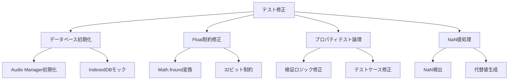

# 設計書: テスト修正

## 概要

MONOLOG LIVEプロジェクトで発生している11個のテストスイート失敗を体系的に修正する。主な問題は、データベース初期化エラー、fast-check float制約エラー、プロパティテストの論理エラー、NaN値処理の問題である。

## アーキテクチャ

### 修正対象の分類



## コンポーネントとインターフェース

### 1. データベース初期化修正

```typescript
interface DatabaseTestSetup {
  initializeTestDatabase(): Promise<void>;
  createMockDatabase(): MockDatabase;
  cleanupTestDatabase(): Promise<void>;
}

interface MockDatabase {
  getAll(storeName: string): Promise<any[]>;
  put(storeName: string, data: any): Promise<void>;
  delete(storeName: string, key: any): Promise<void>;
}
```

### 2. Float制約修正

```typescript
interface SafeFloatGenerator {
  generateFloat(min: number, max: number): fc.Arbitrary<number>;
  convertToSafeFloat(value: number): number;
  validateFloatConstraints(min: number, max: number): boolean;
}

// 修正例
const safeFloat = (min: number, max: number) => 
  fc.float({ 
    min: Math.fround(min), 
    max: Math.fround(max) 
  });
```

### 3. プロパティテスト論理修正

```typescript
interface PropertyTestValidator {
  validateAudioLifecycle(config: AudioConfig, transcript: string): boolean;
  validateStorageQuota(usage: StorageUsage, threshold: number): boolean;
  validateContinuousRecording(duration: number): boolean;
  validateCommentGeneration(context: CommentContext, count: number): boolean;
}
```

### 4. NaN値処理

```typescript
interface NaNSafeGenerator {
  generateSafeNumber(min: number, max: number): fc.Arbitrary<number>;
  validateNumber(value: number): boolean;
  replaceNaN(value: number, fallback: number): number;
}
```

## データモデル

### テスト修正設定

```typescript
interface TestFixConfiguration {
  databaseMocking: {
    enabled: boolean;
    mockType: 'memory' | 'indexeddb-mock';
    autoCleanup: boolean;
  };
  
  floatGeneration: {
    useSafeConstraints: boolean;
    autoConvert: boolean;
    validateRange: boolean;
  };
  
  propertyTesting: {
    maxIterations: number;
    shrinkingEnabled: boolean;
    verboseMode: boolean;
  };
  
  nanHandling: {
    strictValidation: boolean;
    fallbackValues: Record<string, number>;
    logWarnings: boolean;
  };
}
```

### エラー分類

```typescript
interface TestError {
  type: 'database' | 'float-constraint' | 'property-logic' | 'nan-value';
  testFile: string;
  testName: string;
  errorMessage: string;
  counterExample?: any;
  suggestedFix: string;
}
```

## 正確性プロパティ

*プロパティとは、システムの全ての有効な実行において真であるべき特性や動作の形式的な記述である。プロパティは人間が読める仕様と機械で検証可能な正確性保証の橋渡しとなる。*

### プロパティ反映

プロパティ反映ステップ：
1. 前作業分析で特定された全てのプロパティを確認
2. 論理的に冗長なプロパティを特定（一つのプロパティが他を含意する場合）
3. より包括的な単一プロパティに統合可能なプロパティを特定
4. 冗長なプロパティを削除または統合としてマーク
5. 残りの各プロパティが独自の検証価値を提供することを確認

**冗長性の例：**
- プロパティ2.1（fc.floatでの32ビット制約）とプロパティ2.3（ジェネレーター実行でのエラー無し）は統合可能
- プロパティ4.1（NaN値生成無し）とプロパティ4.2（NaN失敗無し）は統合可能
- プロパティ5.1（モック設定）とプロパティ5.4（クリーンアップ）は統合可能

### 統合後のプロパティ

**プロパティ1: データベース初期化の一貫性**
*任意の* テスト実行において、Audio_Managerのデータベース操作は初期化エラーを発生させることなく正常に完了する
**検証: 要件 1.1, 1.2, 1.3**

**プロパティ2: Float制約の安全性**
*任意の* fast-checkジェネレーターにおいて、float値生成は32ビット制約内で実行され、制約エラーを発生させない
**検証: 要件 2.1, 2.3, 2.4**

**プロパティ3: NaN値の排除**
*任意の* テストデータ生成において、NaN値は生成されず、全ての数値計算結果は有効な数値である
**検証: 要件 4.1, 4.2, 4.3, 4.4**

**プロパティ4: テストライフサイクルの完全性**
*任意の* テストスイート実行において、必要なモックが設定され、テスト完了時にリソースが適切にクリーンアップされる
**検証: 要件 5.1, 5.4**

**プロパティ5: エラーハンドリングのフォールバック**
*任意の* システムエラー発生時において、適切なフォールバック処理が実行され、テストが継続可能な状態を維持する
**検証: 要件 6.1, 6.2, 6.3**

## エラーハンドリング

### データベースエラー処理

```typescript
class DatabaseErrorHandler {
  async handleInitializationError(error: Error): Promise<MockDatabase> {
    console.warn('Database initialization failed, using mock:', error.message);
    return new MockDatabase();
  }
  
  async handleOperationError(operation: string, error: Error): Promise<any> {
    console.warn(`Database operation ${operation} failed:`, error.message);
    return this.getFallbackResult(operation);
  }
}
```

### Float制約エラー処理

```typescript
class FloatConstraintHandler {
  static createSafeFloat(min: number, max: number): fc.Arbitrary<number> {
    const safeMin = Math.fround(min);
    const safeMax = Math.fround(max);
    
    if (safeMin !== min || safeMax !== max) {
      console.warn(`Float constraints adjusted: ${min}->${safeMin}, ${max}->${safeMax}`);
    }
    
    return fc.float({ min: safeMin, max: safeMax });
  }
}
```

### NaN値処理

```typescript
class NaNHandler {
  static validateAndReplace(value: number, fallback: number = 0): number {
    if (Number.isNaN(value)) {
      console.warn(`NaN value detected, using fallback: ${fallback}`);
      return fallback;
    }
    return value;
  }
  
  static createSafeGenerator(min: number, max: number): fc.Arbitrary<number> {
    return fc.float({ min, max }).filter(n => !Number.isNaN(n));
  }
}
```

## テスト戦略

### 二重テストアプローチ

**単体テスト**:
- 特定の修正例とエッジケースを検証
- 統合ポイント間のテスト
- エラー条件と境界値のテスト

**プロパティテスト**:
- ランダム化による包括的な入力カバレッジを通じた普遍的プロパティ
- 最小100回の反復（ランダム化のため）
- 各プロパティテストは設計書のプロパティを参照
- タグ形式: **Feature: test-fixes, Property {number}: {property_text}**

### プロパティテスト設定

各正確性プロパティは単一のプロパティベーステストで実装される：

1. **Property 1**: データベース初期化テスト - 様々なテスト環境でのデータベース操作
2. **Property 2**: Float制約テスト - 様々な数値範囲でのジェネレーター実行
3. **Property 3**: NaN値排除テスト - 様々な計算パターンでのNaN検出
4. **Property 4**: テストライフサイクルテスト - 様々なテストスイート構成での初期化とクリーンアップ
5. **Property 5**: エラーハンドリングテスト - 様々なエラー条件でのフォールバック動作

### 単体テストバランス

- 単体テストは特定の例とエッジケースに有用
- プロパティベーステストが多数の入力を処理するため、過度な単体テストは避ける
- 単体テストの焦点：
  - 正しい動作を示す具体例
  - コンポーネント間の統合ポイント
  - エッジケースとエラー条件
- プロパティテストの焦点：
  - 全ての入力に対して成り立つ普遍的プロパティ
  - ランダム化による包括的入力カバレッジ